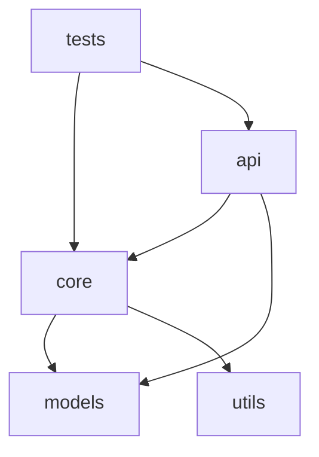

# Claude Code Checkpoint System
## Comprehensive Context Recovery Architecture

This document defines a structured checkpoint system for Claude Code that captures complete project state for disaster recovery and context restoration.

---

## Directory Structure

```
.claude/
├── checkpoints/
│   ├── checkpoint-YYYYMMDD-HHMM.md         # Full state snapshots
│   └── incremental-YYYYMMDD-HHMM.md        # Session-specific updates
├── context/
│   ├── 01-architecture.md                   # System architecture
│   ├── 02-codebase-map.md                   # File/module relationships
│   ├── 03-data-models.md                    # Data structures & schemas
│   ├── 04-patterns.md                       # Design patterns in use
│   ├── 05-decisions.md                      # Architecture Decision Records
│   ├── 06-dependencies.md                   # External & internal deps
│   ├── 07-gotchas.md                        # Known issues & workarounds
│   └── 08-progress.md                       # Current implementation state
├── sessions/
│   ├── session-YYYYMMDD-HHMM.md            # Individual session notes
│   └── session-index.md                     # Session timeline
└── memory-bank/
    ├── lessons-learned.md                   # Accumulated wisdom
    ├── failed-approaches.md                 # What didn't work & why
    └── success-patterns.md                  # What worked well
```

---

## File Templates

### 1. Full Checkpoint Template
**File**: `.claude/checkpoints/checkpoint-YYYYMMDD-HHMM.md`

```markdown
# Project Checkpoint: [Date/Time]
Generated: [ISO timestamp]
Git Commit: [hash]
Branch: [name]

## Executive Summary
[2-3 sentence project state summary]

## Project Metadata
- **Project Name**: 
- **Primary Language(s)**: 
- **Framework(s)**: 
- **Database**: 
- **Deployment**: 
- **Team Size**: 
- **Active Since**: 

## Current State Assessment

### Implementation Status
- **Phase**: [Discovery/Design/Implementation/Testing/Deployment]
- **Completion**: [0-100%]
- **Blockers**: [None/List]
- **Next Milestone**: 

### Active Work Areas
1. [Component/Feature]: [Status] - [Brief description]
2. [Component/Feature]: [Status] - [Brief description]

### Recent Completions (Last 7 Days)
- [Date]: [What was completed]
- [Date]: [What was completed]

## Architectural Overview

### System Architecture
[High-level architecture description]

### Key Components
1. **[Component Name]**
   - Location: `path/to/component`
   - Purpose: [What it does]
   - Key Files: [List 3-5 critical files]
   - Dependencies: [What it depends on]
   - Dependents: [What depends on it]

2. **[Component Name]**
   [Same structure]

### Data Flow
```
[Component A] → [Component B] → [Component C]
       ↓
[Component D]
```

Description: [How data moves through system]

### Critical Paths
1. **User Authentication Flow**: [path1] → [path2] → [path3]
2. **Data Processing Pipeline**: [path1] → [path2] → [path3]
3. **API Request Lifecycle**: [path1] → [path2] → [path3]

## Codebase Map

### Directory Structure
```
root/
├── src/
│   ├── core/          [Core business logic]
│   ├── api/           [API endpoints]
│   ├── models/        [Data models]
│   └── utils/         [Utilities]
├── tests/             [Test suite]
├── docs/              [Documentation]
└── config/            [Configuration]
```

### File Inventory (Critical Files)
| File Path | Purpose | Lines | Last Modified | Stability |
|-----------|---------|-------|---------------|-----------|
| `src/core/engine.py` | Main processing engine | 450 | 2025-01-05 | Stable |
| `src/api/routes.py` | API routing | 320 | 2025-01-06 | Active Dev |

### Module Dependencies


## Design Patterns & Conventions

### Architectural Patterns
- **Pattern**: [e.g., MVC, Repository, Factory]
  - **Where Used**: [Locations]
  - **Rationale**: [Why this pattern]

### Code Conventions
- **Naming**: [Convention description]
- **File Organization**: [Convention description]
- **Error Handling**: [Convention description]
- **Testing**: [Convention description]

### Technology-Specific Patterns
- **[Language/Framework]**: [Specific patterns used]

## Architecture Decision Records

### ADR-001: [Decision Title]
- **Date**: YYYY-MM-DD
- **Status**: [Proposed/Accepted/Deprecated/Superseded]
- **Context**: [Why this decision was needed]
- **Decision**: [What was decided]
- **Consequences**: [Impact of this decision]
- **Alternatives Considered**: [What else was considered]

### ADR-002: [Decision Title]
[Same structure]

## Current Implementation Details

### Work In Progress
#### [Feature/Component Name]
- **Started**: [Date]
- **Current Status**: [Description]
- **Files Modified**: 
  - `path/to/file1.ext` - [Changes made]
  - `path/to/file2.ext` - [Changes made]
- **Remaining Tasks**:
  - [ ] Task 1
  - [ ] Task 2
- **Dependencies**: [Waiting on what]
- **Blockers**: [What's blocking]

### Recently Completed Work
[Same structure for completed items]

## Known Issues & Gotchas

### Active Bugs
1. **[Bug Title]** - [Severity: High/Medium/Low]
   - **Symptoms**: [How it manifests]
   - **Location**: [Where in code]
   - **Workaround**: [Temporary fix if any]
   - **Root Cause**: [If known]
   - **Fix Status**: [Planned/In Progress/Unknown]

### Technical Debt
1. **[Debt Item]**
   - **Impact**: [How it affects development]
   - **Priority**: [High/Medium/Low]
   - **Effort**: [Estimated effort to fix]

### Environment-Specific Issues
- **Development**: [Issues]
- **Staging**: [Issues]
- **Production**: [Issues]

### Known Workarounds
- **Issue**: [Problem description]
  - **Workaround**: [How to work around it]
  - **Why Needed**: [Underlying reason]

## Dependencies & Integrations

### External Dependencies
| Package | Version | Purpose | Update Status | Notes |
|---------|---------|---------|---------------|-------|
| library-name | 2.3.1 | [Purpose] | Current | [Any issues] |

### Internal Dependencies
- **[Module A]** depends on **[Module B]** for [reason]
- Cross-cutting concerns: [logging, auth, etc.]

### Third-Party Integrations
1. **[Service Name]**
   - **Purpose**: [What it does]
   - **Auth Method**: [How we authenticate]
   - **Rate Limits**: [Any limits]
   - **Failure Mode**: [What happens if it fails]

## Testing & Quality

### Test Coverage
- **Overall**: [X%]
- **Unit Tests**: [X%]
- **Integration Tests**: [X%]
- **E2E Tests**: [X%]

### Testing Strategy
- **Unit Testing**: [Approach]
- **Integration Testing**: [Approach]
- **Performance Testing**: [Approach]

### Quality Metrics
- **Code Complexity**: [Metrics]
- **Maintainability Index**: [Score]
- **Test Execution Time**: [Time]

## Configuration & Environment

### Environment Variables
| Variable | Purpose | Default | Required |
|----------|---------|---------|----------|
| DATABASE_URL | DB connection | None | Yes |

### Configuration Files
- `.env.example` - [Purpose]
- `config/app.yaml` - [Purpose]

### Build & Deployment
- **Build Command**: `[command]`
- **Test Command**: `[command]`
- **Deploy Command**: `[command]`
- **Deployment Target**: [Where it deploys]

## Git State Analysis

### Recent Commits (Last 10)
```
[hash-short] [date] [author] - [commit message]
[hash-short] [date] [author] - [commit message]
```

### Branch Structure
- **main**: [Description of main branch state]
- **develop**: [Description]
- **feature/***: [Active feature branches]

### Uncommitted Changes
- Modified: [files]
- Added: [files]
- Deleted: [files]

### Git Workflow Insights
- **Commit Frequency**: [Average commits per day]
- **Active Contributors**: [Number]
- **Hot Spots**: [Files changed most often]

## Session History Integration

### Previous Session Summary
[Parsed from most recent SESSION_NOTES]
- **Session Date**: 
- **Duration**: 
- **Focus**: 
- **Achievements**: 
- **Challenges**: 

### Session Pattern Analysis
- **Common Topics**: [Recurring themes from session notes]
- **Evolution**: [How focus has shifted over time]
- **Velocity**: [Trend in completion rate]

## Lessons Learned

### What's Working Well
1. [Pattern/Practice] - [Why it's effective]
2. [Pattern/Practice] - [Why it's effective]

### What's Not Working
1. [Anti-pattern] - [Why it's problematic]
2. [Anti-pattern] - [Why it's problematic]

### Recommended Approaches
- **For [Task Type]**: [Recommended approach]
- **For [Task Type]**: [Recommended approach]

### Failed Experiments
1. **[Approach Tried]**
   - **Rationale**: [Why we tried it]
   - **Outcome**: [What happened]
   - **Lesson**: [What we learned]

## Context Recovery Instructions

### For Immediate Resumption
1. Read this checkpoint file
2. Review `.claude/context/08-progress.md` for latest state
3. Check git status for uncommitted work
4. Review most recent session notes in `.claude/sessions/`

### For Long-Term Recovery (Weeks/Months Later)
1. Start with Executive Summary
2. Review Architectural Overview
3. Check Current Implementation Details for incomplete work
4. Read Known Issues & Gotchas for current pain points
5. Examine ADRs for context on design decisions
6. Review Lessons Learned for accumulated wisdom

### Critical Questions Answered
- **"What is this project?"**: See Executive Summary
- **"How does it work?"**: See Architectural Overview
- **"What's the current state?"**: See Current State Assessment
- **"What should I work on next?"**: See Work In Progress
- **"What are the gotchas?"**: See Known Issues & Gotchas
- **"Why was it built this way?"**: See ADRs
- **"What have we learned?"**: See Lessons Learned

## Next Steps

### Immediate Priorities (Next Session)
1. [ ] [Task]
2. [ ] [Task]
3. [ ] [Task]

### Short-Term Goals (This Week)
- [Goal]
- [Goal]

### Medium-Term Goals (This Month)
- [Goal]
- [Goal]

## Checkpoint Metadata

- **Checkpoint Type**: Full
- **Generated By**: Claude Code Checkpoint System
- **Generation Time**: [Timestamp]
- **Context Files Used**: 
  - SESSION_NOTES-*.md
  - git log
  - CLAUDE.md
  - .claude/context/*.md
- **Lines of Code**: [Total]
- **File Count**: [Total]
- **Test Count**: [Total]

---

## Appendices

### A. Critical Code Snippets
[Key code patterns or configurations worth preserving]

### B. Reference Links
- Internal docs: [links]
- External resources: [links]
- Related issues: [links]

### C. Glossary
- **[Term]**: [Definition]
- **[Term]**: [Definition]

---

*This checkpoint can be used to fully restore context after catastrophic interruption.*
*Last Updated: [Auto-generated timestamp]*
```

---

### 2. Incremental Session Checkpoint Template
**File**: `.claude/checkpoints/incremental-YYYYMMDD-HHMM.md`

```markdown
# Incremental Checkpoint: [Session Date/Time]
Generated: [ISO timestamp]
Session Duration: [X hours]
Git Commit Range: [start-hash]..[end-hash]

## Session Summary
[2-3 sentence summary of what was accomplished]

## Changes Made
### Files Modified
- `path/to/file` - [Nature of changes]
- `path/to/file` - [Nature of changes]

### New Files Created
- `path/to/file` - [Purpose]

### Files Deleted
- `path/to/file` - [Reason]

## Decisions Made This Session
1. **[Decision]** - [Rationale]
2. **[Decision]** - [Rationale]

## Problems Encountered & Solutions
1. **Problem**: [Description]
   - **Solution**: [How it was solved]
   - **Lesson**: [What was learned]

## Context for Next Session
- **Continue with**: [What to pick up]
- **Be aware**: [Important context]
- **Don't forget**: [Critical reminders]

## Git Integration
```
[git diff --stat output]
[git log --oneline for this session]
```

---

*Incremental checkpoint - merge into full checkpoint periodically*
```

---

### 3. Context File Templates

#### 01-architecture.md
```markdown
# System Architecture

## High-Level Architecture
[System diagram or description]

## Architectural Style
[Monolithic/Microservices/Layered/etc.]

## Core Components
[List of major components and their responsibilities]

## Technology Stack
### Backend
- Runtime: [e.g., Node.js, Python]
- Framework: [e.g., Express, Django]
- Database: [e.g., PostgreSQL]

### Frontend
- Framework: [e.g., React]
- State Management: [e.g., Redux]
- UI Library: [e.g., Material-UI]

### Infrastructure
- Hosting: [e.g., AWS]
- CI/CD: [e.g., GitHub Actions]
- Monitoring: [e.g., DataDog]

## Data Flow
[How data moves through the system]

## Security Model
[Authentication, authorization, encryption]

---
*Last Updated: [Date]*
```

#### 02-codebase-map.md
```markdown
# Codebase Map

## Directory Structure
```
[Tree structure with annotations]
```

## Module Relationships
```mermaid
graph LR
[Dependency graph]
```

## Entry Points
- **Main Application**: `path/to/main.py`
- **API Server**: `path/to/api.py`
- **Background Jobs**: `path/to/worker.py`

## Critical Paths
### [Feature Name] Flow
```
File1.fn() → File2.fn() → File3.fn()
```

## Hot Files (Change Frequently)
| File | Changes/Week | Risk | Notes |
|------|--------------|------|-------|

## Stable Files (Rarely Change)
| File | Last Changed | Maturity | Notes |
|------|--------------|----------|-------|

---
*Last Updated: [Date]*
```

#### 05-decisions.md
```markdown
# Architecture Decision Records

## ADR Index
1. [ADR-001: Title] - [Date] - [Status]
2. [ADR-002: Title] - [Date] - [Status]

---

## ADR-001: [Title]

**Date**: YYYY-MM-DD  
**Status**: Accepted/Deprecated/Superseded

### Context
[What is the issue that we're seeing that is motivating this decision or change?]

### Decision
[What is the change that we're proposing and/or doing?]

### Consequences
**Positive:**
- [Benefit 1]
- [Benefit 2]

**Negative:**
- [Cost 1]
- [Cost 2]

**Risks:**
- [Risk 1]
- [Risk 2]

### Alternatives Considered
1. **[Alternative A]**
   - Pros: [...]
   - Cons: [...]
   - Rejected because: [...]

2. **[Alternative B]**
   - [Same structure]

### References
- [Link to discussion]
- [Related documentation]

---
*Last Updated: [Date]*
```

#### 07-gotchas.md
```markdown
# Known Issues, Gotchas & Workarounds

## Critical Gotchas (Must Know)
### [Gotcha Title]
- **Symptom**: [How it manifests]
- **Cause**: [Root cause]
- **Workaround**: [How to avoid/fix]
- **When it matters**: [In what scenarios]
- **Tracking**: [Issue link if applicable]

## Environment-Specific Issues
### Development
[Issues specific to dev environment]

### Staging
[Issues specific to staging]

### Production
[Issues specific to production]

## Dependency-Related Gotchas
### [Library Name]
- **Issue**: [Description]
- **Workaround**: [Solution]

## Common Pitfalls
1. **[Pitfall]**: [How to avoid it]
2. **[Pitfall]**: [How to avoid it]

## Performance Gotchas
- **[Performance Issue]**: [How to handle]

## Security Gotchas
- **[Security Issue]**: [How to handle]

---
*Last Updated: [Date]*
```

#### 08-progress.md
```markdown
# Current Implementation Progress

**Last Updated**: [ISO timestamp]  
**Current Sprint/Milestone**: [Name]

## Active Development

### In Progress
#### [Feature/Task Name]
- **Owner**: [Name or "Unassigned"]
- **Started**: [Date]
- **Target**: [Date]
- **Status**: [X% complete]
- **Current Focus**: [What's being worked on right now]
- **Files**: [List of files being modified]
- **Blockers**: [None / List]
- **Next Steps**: 
  1. [ ] [Task]
  2. [ ] [Task]

### Recently Completed (Last 7 Days)
- [Date]: [What was completed]
- [Date]: [What was completed]

### Upcoming (Next to Start)
1. **[Task]** - [Priority: High/Med/Low] - [Effort: S/M/L]
2. **[Task]** - [Priority: High/Med/Low] - [Effort: S/M/L]

## Backlog
### High Priority
- [ ] [Task] - [Brief description]

### Medium Priority
- [ ] [Task] - [Brief description]

### Low Priority / Nice to Have
- [ ] [Task] - [Brief description]

## Blocked Items
- **[Task]**: Blocked by [reason]

## Technical Debt Register
| Item | Impact | Effort | Priority |
|------|--------|--------|----------|
| [Description] | High | Medium | Should Fix |

---
*Last Updated: [Date]*
```

---

## Usage Workflow

### Initial Setup
```bash
# In your project root, run these commands in Claude Code:

"Create the checkpoint system directory structure:
.claude/checkpoints/, .claude/context/, .claude/sessions/, .claude/memory-bank/"

"Initialize the context files using the templates I'll provide:
01-architecture.md, 02-codebase-map.md, 03-data-models.md, 
04-patterns.md, 05-decisions.md, 06-dependencies.md, 
07-gotchas.md, 08-progress.md"

"Analyze the current codebase and populate initial content for all context files"
```

### Regular Checkpoint Creation
```bash
# At end of each significant session:

"Create an incremental checkpoint capturing:
1. All changes made this session (git diff, git log)
2. Decisions made and their rationale
3. Problems encountered and solutions
4. Context needed for next session"

# Weekly or after major milestones:

"Create a full checkpoint that:
1. Synthesizes all incremental checkpoints since last full checkpoint
2. Reads and integrates all SESSION_NOTES*.md files
3. Analyzes git log for patterns and velocity
4. Updates all context files with current state
5. Captures lessons learned
6. Provides comprehensive recovery instructions"
```

### Disaster Recovery
```bash
# After catastrophic interruption:

"Load checkpoint system:
1. Read the most recent full checkpoint in .claude/checkpoints/
2. Read all incremental checkpoints since that full checkpoint
3. Review .claude/context/08-progress.md for latest state
4. Check git status for any uncommitted work
5. Summarize: 'Here's where we are and what we were working on'"
```

---

## Maintenance

### Checkpoint Rotation
- **Incremental**: Keep last 30 days
- **Full**: Keep last 90 days, plus monthly archives
- **Session Notes**: Archive to `.claude/sessions/archive/` after 60 days

### Context File Updates
- **08-progress.md**: Update daily
- **07-gotchas.md**: Update when issues discovered
- **05-decisions.md**: Update when decisions made
- **Other files**: Update weekly or as needed

---

## Integration with CLAUDE.md

Add to your `CLAUDE.md`:

```markdown
## Checkpoint System

This project uses a structured checkpoint system for context preservation.

### Location
All checkpoint and context files are in `.claude/`

### When to Create Checkpoints
- **Incremental**: End of each session (>30 min work)
- **Full**: End of week, after major milestones, before breaks

### How to Create Checkpoints
Use the checkpoint creation prompts in `.claude/CHECKPOINT_SYSTEM.md`

### Recovery from Interruption
1. Read most recent full checkpoint
2. Read incremental checkpoints since then
3. Review progress.md
4. Check git status

### Checkpoint Files
- **checkpoints/**: Full and incremental snapshots
- **context/**: Persistent project knowledge
- **sessions/**: Individual session logs
- **memory-bank/**: Lessons learned

See `.claude/CHECKPOINT_SYSTEM.md` for complete documentation.
```

---

## Benefits

1. **Comprehensive Recovery**: Full project state can be reconstructed
2. **Human Readable**: All in markdown, can be read by humans or AI
3. **Version Controlled**: Checkpoint files can be committed to git
4. **Incremental Updates**: Efficient session-to-session updates
5. **Knowledge Accumulation**: Lessons learned persist across sessions
6. **Structured Navigation**: Clear hierarchy of information
7. **Git Integration**: Leverages existing git history
8. **Session Notes Integration**: Incorporates existing session practices

---

*This system transforms session notes from conversation logs into structured, recoverable project knowledge.*
